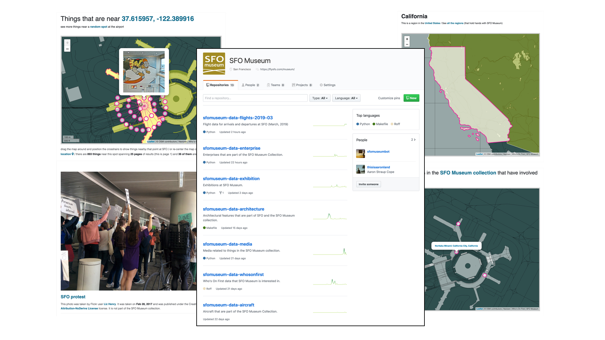
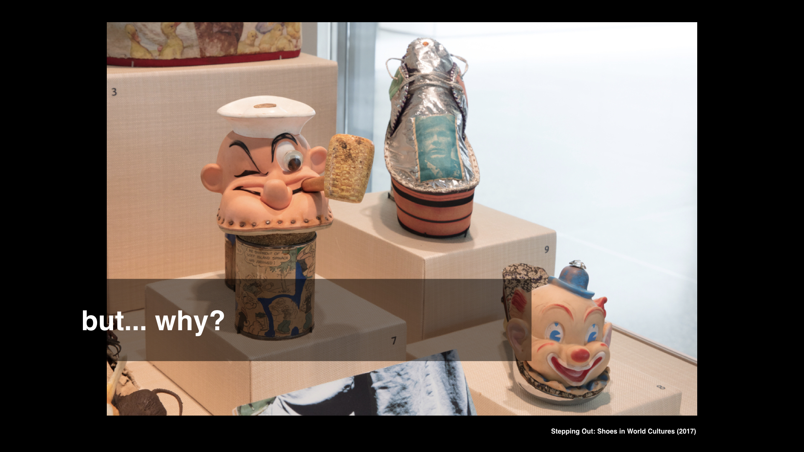

# sfomuseum-data

This is a placeholder repository for all the other `sfomuseum-data` repositories and a single, centralized, place to file issues.

## Motivation

_The following is excerpted from the [Mapping Space and Time at SFO Museum](https://www.aaronland.info/weblog/2019/04/08/post/#mw19), presented at Museums and the Web 2019:_

> Historically the model for most digital or web-based initiatives has been to first export data from an internal collections management system. Second, that data is massaged in to an intermediate form for use by the project at hand and then third, exported again in to a typically bespoke machine-readable format.

> We have changed the order of things to publish the open data representation first and then, from there, to build our own websites and services on top of that.

> Everything I've described so far has been built using the same raw materials that we've made available for you to do something with. This introduces a non-zero cost in the build process for the public-facing museum efforts but we believe it's worth the cost.

> But why, right?

> First of all we want other people to build new interfaces and new services, new "experiences" even, on top of our collection so this is a way to keep ourselves honest. If we can't build something with this stuff why should we imagine you will?

> Second, we want to ensure that the data we release and the manner in which it is published, is actually robust and flexible enough to engender a variety of interfaces and uses because we need that variety. It is important to the museum because I don't believe there is, or should be, only one master narrative in to the collection.